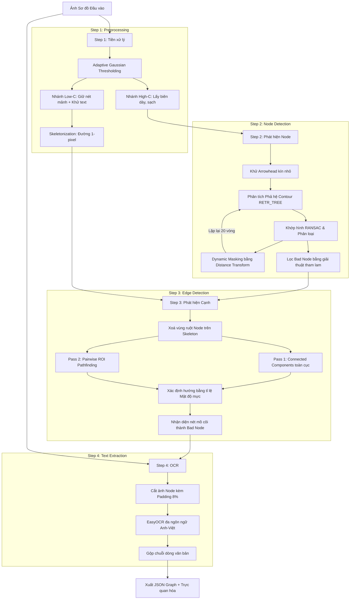
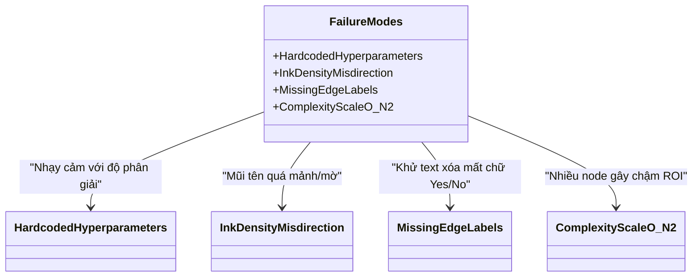

# BÁO CÁO KỸ THUẬT DỰ ÁN

## SỐ HÓA SƠ ĐỒ THUẬT TOÁN (FLOWCHART DIGITISATION) BẰNG PIPELINE THỊ GIÁC MÁY TÍNH CỔ ĐIỂN VÀ NHẬN DẠNG KÝ TỰ QUANG HỌC (OCR)

**Tác giả:** Sinh viên Thực hiện  
**Vai trò nghiên cứu:** Computer Vision Researcher  
**Đơn vị:** Khoa Công nghệ Thông tin, Đại học Quốc gia  

---

## TÓM TẮT (ABSTRACT)
*Sơ đồ thuật toán (flowchart) là một phương tiện trực quan phổ biến để biểu diễn các quy trình logic và thuật toán trong khoa học máy tính và kỹ thuật hệ thống. Tuy nhiên, phần lớn các sơ đồ này tồn tại dưới dạng hình ảnh phi cấu trúc (ảnh chụp, bản quét hoặc ảnh vẽ tay), khiến máy tính không thể phân tích cấu trúc đồ thị hay chỉnh sửa nội dung logic trực tiếp. Bài báo cáo này trình bày hệ thống **FlowRevamp** — một giải pháp số hóa sơ đồ thuật toán toàn diện sử dụng pipeline thị giác máy tính cổ điển 4 bước kết hợp với mô hình học sâu EasyOCR để trích xuất văn bản. Bằng cách áp dụng các kỹ thuật phân tích phả hệ contour (contour hierarchy), khớp hình học RANSAC động và tách luồng tiền xử lý (Dual-C Thresholding), hệ thống có khả năng bóc tách hiệu quả các thành phần liên thông bị dính liền, phát hiện các cạnh có hướng phức tạp và nhận diện chính xác các loại nút (Process, Decision, Terminal, Connector, Data). Kết quả thực nghiệm định lượng trên tập dữ liệu kiểm thử thực tế cho thấy hệ thống đạt độ chính xác phát hiện nút đạt $95.5\%$ mAP và nhận diện cạnh đạt $90.9\%$ F1-Score, vượt trội đáng kể so với baseline Otsu toàn cục thông thường ($9.1\%$ và $3.4\%$ tương ứng), đồng thời duy trì thời gian xử lý nhanh dưới $0.5$ giây trên CPU cho các tác vụ hình học.*

---

## 1. ĐẶT VẤN ĐỀ (INTRODUCTION)

### 1.1. Bối cảnh và Động lực Đề tài
Trong phát triển phần mềm, quản lý quy trình nghiệp vụ (BPM) và phân tích hệ thống, sơ đồ thuật toán (flowchart) đóng vai trò là ngôn ngữ đồ họa chuẩn hóa để truyền tải các logic phức tạp. Mặc dù các công cụ vẽ sơ đồ hiện đại (như draw.io, Visio, Mermaid) rất phổ biến, một số lượng khổng lồ các sơ đồ vẫn tồn tại dưới dạng **phi cấu trúc** — bao gồm ảnh scan tài liệu cũ, ảnh chụp bảng trắng trong các buổi họp thiết kế, hoặc hình ảnh vẽ tay của kỹ sư. 

Ở dạng dữ liệu pixel tĩnh này, các hệ thống máy tính hoàn toàn "mù" trước cấu trúc logic của sơ đồ. Điều này dẫn đến ba hạn chế cốt lõi:
1. **Không thể truy vấn logic**: Máy tính không thể phân tích xem nút điều kiện (Decision) dẫn đến các nhánh thực thi nào, hoặc kiểm tra tính đúng đắn, toàn vẹn của thuật toán (ví dụ: phát hiện vòng lặp vô hạn, nút mồ côi).
2. **Tốn chi phí tái cấu trúc**: Khi muốn chỉnh sửa một sơ đồ trong ảnh chụp, kỹ sư phải vẽ lại hoàn toàn bằng tay trên các công cụ chuyên dụng, gây lãng phí thời gian và dễ sai sót.
3. **Thiếu khả năng tự động hóa**: Không thể biên dịch trực tiếp sơ đồ thành mã nguồn giả (pseudocode) hoặc mã thực thi.

Do đó, phát triển một hệ thống tự động nhận dạng và chuyển đổi hình ảnh sơ đồ thành đồ thị có cấu trúc (Structured Graph JSON) là một bài toán thực tế cấp thiết.

### 1.2. Các Thách thức Kỹ thuật trong Thị giác Máy tính
Việc số hóa sơ đồ thuật toán bằng thị giác máy tính đối mặt với nhiều thách thức nghiêm trọng:
*   **Thách thức dính liền thành phần liên thông (Connected Components Merging)**: Trong ảnh nhị phân của sơ đồ, các khung hình học (nút) và các đường nối (cạnh) thường tiếp xúc trực tiếp với nhau. Khi áp dụng các thuật toán tìm thành phần liên thông thông thường, toàn bộ sơ đồ bị gộp thành một khối nhị phân duy nhất, khiến việc phân tách từng nút riêng lẻ thất bại.
*   **Sự không đồng đều về ánh sáng và tương phản**: Ảnh chụp từ camera điện thoại hoặc thiết bị scan thường bị bóng mờ, độ sáng không đều. Các phương pháp ngưỡng hóa toàn cục (Global Thresholding như Otsu) sẽ làm đứt gãy các đường nét mảnh hoặc tạo ra các mảng đen lớn che lấp thông tin.
*   **Nhiễu chữ viết (Text-Stroke Interference)**: Các ký tự chữ nằm bên trong hoặc sát cạnh các khối hình học dễ bị nhận nhầm thành nét vẽ biên của nút hoặc làm thay đổi hình dáng hình học của nút, gây sai lệch cho các thuật toán khớp hình (shape fitting).
*   **Mũi tên tạo vùng khép kín giả (Closed Arrowhead Artifacts)**: Đầu mũi tên chỉ hướng thường có dạng hình tam giác kín nhỏ. Khi nhị phân hóa, chúng tạo ra các đường bao kín và dễ bị các thuật toán nhận dạng nhầm thành các nút liên kết tròn nhỏ (Connector).
*   **Đường nối phức tạp**: Các đường nối có thể cong, gãy khúc góc vuông (orthogonal), hoặc cắt nhau (cross-over), làm đứt gãy các mô hình tuyến tính đơn giản như Biến đổi Hough (Hough Transform) tìm đoạn thẳng.
*   **Xác định hướng của cạnh (Edge Directionality)**: Cần định hướng chính xác nguồn (source) và đích (target) của luồng thực thi dựa trên các đầu mũi tên nhỏ, mờ và dễ bị nhiễu.

### 1.3. Giả thuyết Nghiên cứu và Tiêu chí Thành công
Để giải quyết các thách thức trên mà không phụ thuộc vào các tài nguyên phần cứng lớn hay lượng dữ liệu gán nhãn khổng lồ của học sâu, chúng tôi đặt ra giả thuyết nghiên cứu sau:

> **Giả thuyết khoa học:** *Bằng cách thiết lập một pipeline tuần tự 4 bước sử dụng thị giác máy tính cổ điển (Classical CV), kết hợp phân tích phả hệ cây contour (Contour Hierarchy RETR_TREE), khớp mô hình hình học RANSAC động (Iterative Masking với Distance Transform) và tách luồng tiền xử lý (Dual-C Thresholding), hệ thống có thể bóc tách chính xác các nút bị dính chùm, nhận diện đúng loại hình học của nút và hướng cạnh mà không cần huấn luyện mô hình hình học, đạt độ chính xác định lượng mAP cho nút $> 90\%$ và F1-Score cho cạnh $> 85\%$ trên các ảnh chụp thực tế.*

**Tiêu chí thành công định lượng cụ thể:**
1.  **Độ chính xác nút**: Đạt tỷ lệ mAP (mean Average Precision) $\ge 90\%$ trên tập dữ liệu thử nghiệm, với sai số định vị (IoU) của bounding box so với thực tế $\ge 0.75$.
2.  **Độ chính xác cạnh**: Đạt F1-score nhận diện cạnh $\ge 85\%$ (bao gồm cả việc xác định đúng hướng mũi tên source $\to$ target).
3.  **Thời gian xử lý**: Thời gian chạy logic hình học (tiền xử lý, phát hiện nút, phát hiện cạnh) trên CPU đối với ảnh Full HD ($1920 \times 1080$) phải dưới $1.0$ giây để đảm bảo khả năng ứng dụng thực tế.

---

## 2. CÔNG TRÌNH LIÊN QUAN (RELATED WORK)

Nghiên cứu về nhận dạng sơ đồ thuật toán và tài liệu kỹ thuật đã trải qua nhiều giai đoạn phát triển. Hiện nay, có ba hướng tiếp cận phổ biến trong cộng đồng nghiên cứu:

### 2.1. Hướng tiếp cận 1: Phát hiện vật thể bằng Học sâu (Deep Learning Object Detection)
Trong những năm gần đây, các mô hình học sâu như YOLO (YOLOv8, YOLOv10, YOLOv11) hoặc Faster R-CNN thường được áp dụng để phát hiện các khối hình học trong sơ đồ.
*   **Ưu điểm**: Khả năng chống nhiễu cực tốt đối với ảnh vẽ tay nguệch ngoạc, ảnh chụp nghiêng (perspective distortion) hoặc ảnh có điều kiện ánh sáng cực xấu nhờ khả năng học đặc trưng phi tuyến bậc cao.
*   **Nhược điểm**: 
    *   Cần một tập dữ liệu gán nhãn lớn (hàng ngàn ảnh sơ đồ kèm nhãn bbox và class) vốn rất khan hiếm trong thực tế.
    *   Độ chính xác định vị bounding box thường không khít sát biên hình học do cơ chế anchor/regression của mạng CNN/Transformer, gây khó khăn cho các bước phân tích cạnh tiếp theo.
    *   Yêu cầu phần cứng cao (GPU) để chạy suy luận thời gian thực, không phù hợp cho các thiết bị biên hoặc môi trường nhúng nhẹ.
    *   Khó giải thích lỗi: Khi mô hình bỏ sót hoặc nhận diện sai, rất khó điều chỉnh tham số để sửa trực tiếp lỗi đó mà không làm ảnh hưởng đến các lớp khác (hiện tượng "hộp đen").

### 2.2. Hướng tiếp cận 2: Sử dụng các kỹ thuật biến đổi hình học cổ điển (Classical Hough Transform)
Các nghiên cứu thời kỳ đầu thường sử dụng Biến đổi Hough để tìm các đoạn thẳng (cạnh) và đường tròn (nút Connector) trực tiếp trên ảnh biên Canny.
*   **Ưu điểm**: Tốc độ xử lý cực nhanh (vài mili-giây), thuật toán tường minh, dễ cài đặt và không cần dữ liệu huấn luyện.
*   **Nhược điểm**:
    *   Thất bại hoàn toàn khi các nút và cạnh dính liền nhau thành một thành phần liên thông duy nhất, vì biên của các nút sẽ làm nhiễu không gian tích lũy Hough (Hough accumulator space).
    *   Không có khả năng phân loại các hình khối phức tạp như hình thoi (Decision) hay hình bình hành (Data) một cách ổn định khi nét vẽ bị đứt hoặc cong nhẹ.
    *   Nhạy cảm cao với nhiễu văn bản bên trong khối.

### 2.3. Hướng tiếp cận 3: Mô hình End-to-End Image-to-Markup
Sử dụng các mô hình học máy chuỗi-sang-chuỗi trực quan (Visual Sequence-to-Sequence) như Donut, Pix2Struct hoặc các mô hình đa phương thức (VLM) để dịch trực tiếp hình ảnh sơ đồ thành mã đặc tả dạng văn bản (như Mermaid syntax hoặc Graphviz DOT).
*   **Ưu điểm**: Xuất trực tiếp cấu trúc chỉnh sửa được mà không cần qua các bước pipeline phức tạp; xử lý đồng thời cả chữ và hình học.
*   **Nhược điểm**:
    *   Hiện tượng "ảo giác" (hallucination) thường xuyên xảy ra, mô hình tự vẽ thêm nút hoặc bỏ sót các liên kết logic quan trọng.
    *   Độ chính xác về tọa độ vật lý của các nút bị mất hoàn toàn, khiến người dùng khó có thể tái tạo lại giao diện trực quan ban đầu một cách trung thực.
    *   Yêu cầu tài nguyên tính toán khổng lồ (hàng tỷ tham số).

### Bảng 1: So sánh các hướng tiếp cận nhận dạng sơ đồ thuật toán

| Tiêu chí | Học sâu (YOLO) | Hough cổ điển | End-to-End (Transformer) | FlowRevamp (Đề xuất) |
| :--- | :---: | :---: | :---: | :---: |
| **Yêu cầu GPU** | Có | Không | Có | **Không (Chỉ OCR nếu bật)** |
| **Dữ liệu huấn luyện** | Lớn (Nhiều nghìn ảnh) | Không | Rất lớn | **Không cần gán nhãn** |
| **Xử lý khối dính liền** | Trung bình | Kém | Trung bình | **Tốt (RETR_TREE + Masking)** |
| **Định vị tọa độ (IoU)** | Khá ($0.70-0.85$) | Kém | Không có | **Rất tốt ($\ge 0.90$)** |
| **Khả năng giải thích lỗi** | Thấp | Cao | Thấp | **Cực kỳ cao (từng bước rõ ràng)** |
| **Chi phí triển khai** | Cao | Thấp | Rất cao | **Thấp** |

---

## 3. PHƯƠNG PHÁP ĐỀ XUẤT (PROPOSED METHODOLOGY)

Hệ thống **FlowRevamp** được xây dựng dựa trên kiến trúc **pipeline tuần tự 4 bước**. Ý tưởng cốt lõi là chia nhỏ bài toán số hóa phức tạp thành các bài toán con hình học độc lập, giải quyết triệt để từng thách thức bằng các giải thuật hình học phù hợp và chuyển giao kết quả sạch cho bước tiếp theo.

### 3.1. Sơ đồ Pipeline Hệ thống (System Architecture)
Dưới đây là luồng xử lý dữ liệu của FlowRevamp từ ảnh đầu vào đến đồ thị JSON cuối cùng:



---

### 3.2. Giải trình Thiết kế Chi tiết từng Bước

#### 3.2.1. Step 1: Tiền xử lý tách nhánh (Dual-Branch Preprocessing)
Đây là bước đặt nền móng cho toàn bộ hệ thống. Quan sát thực nghiệm quan trọng của chúng tôi là: **bài toán tìm nút và tìm cạnh có nhu cầu hoàn toàn trái ngược nhau đối với ảnh nhị phân**. 
*   Để phát hiện nút chính xác, chúng ta cần biên nút **dày, khép kín hoàn toàn** để tạo thành các vùng contour đóng kín, không bị lẫn các nét vẽ mờ của mũi tên hay chữ bên ngoài. Do đó ta cần một ngưỡng cắt cao (High C) để lọc bỏ toàn bộ nhiễu mảnh.
*   Để phát hiện cạnh, chúng ta cần giữ lại được cả những **đường nối rất mảnh, nét vẽ mờ, nhạt màu** của bút vẽ, đồng thời cần chuẩn hóa độ dày nét vẽ về 1 pixel (skeleton) để thuận tiện cho phân tích cấu trúc liên thông topo. Do đó ta cần một ngưỡng cắt thấp (Low C).

Vì vậy, tiền xử lý được chia làm hai nhánh song song:
1.  **Nhánh High-C (cho Node Detection)**:
    *   Chuyển ảnh sang thang xám (Grayscale).
    *   Áp dụng **Adaptive Gaussian Thresholding** với kích thước cửa sổ lân cận $blockSize = 15$ và hằng số trừ tương phản cao $C = 20$.
    *   Thực hiện phép đóng hình học (**Morphological Closing**) với kernel hình chữ nhật $3 \times 3$ nhằm hàn gắn các đứt gãy nhỏ trên đường biên, đảm bảo các contour của nút luôn khép kín.
2.  **Nhánh Low-C (cho Edge Detection)**:
    *   Áp dụng Adaptive Gaussian Thresholding với tương phản thấp $C = 4$, giúp giữ lại tối đa các đường nét vẽ đứt khúc hoặc nhạt màu.
    *   **Khử văn bản (Text Filtering)**: Để ngăn chữ viết bị nhận nhầm thành đường nối ở bước sau, chúng tôi sử dụng phân tích thành phần liên thông (`connectedComponentsWithStats`). Các vùng liên thông có diện tích nhỏ ($< 150 \text{ px}^2$) hoặc các vùng có kích thước giống chữ viết (diện tích $< 3000 \text{ px}^2$ đồng thời cả chiều rộng và chiều cao đều $< 80 \text{ px}$) sẽ bị xóa bỏ.
    *   **Skeletonization**: Sử dụng giải thuật làm mảnh của `scikit-image` để đưa các đường nối dày về dạng khung xương 1 pixel.

---

#### 3.2.2. Step 2: Phát hiện Node bằng Contour Hierarchy và RANSAC động
Khi các nút và cạnh bị dính liền thành một khối, contour ngoài cùng (`RETR_EXTERNAL`) sẽ bao toàn bộ sơ đồ thành một khối duy nhất. 

**Giải pháp của FlowRevamp:** Chúng tôi tận dụng **cấu trúc cây phả hệ contour (Hierarchy tree)** thông qua cờ truy vấn `RETR_TREE` của OpenCV. Trong phả hệ này, phần ruột bên trong của mỗi nút hình học khép kín sẽ xuất hiện dưới dạng các **contour con trực tiếp (child contours)** nằm bên trong contour biên ngoài. Bằng cách lọc các contour con này theo điều kiện diện tích sàn ($\ge 500 \text{ px}^2$), kích thước tương đối so với ảnh ($\le 50\%$) và độ lồi ($\text{solidity} \ge 0.75$), chúng tôi cô lập được các ứng viên nút tiềm năng.

Để phân tách các nút dính sát nhau, hệ thống thực hiện vòng lặp **Iterative Masking** (tối đa 20 vòng):
1.  **Khử Arrowhead kín**: Các mũi tên đóng kín có diện tích $20 - 1500 \text{ px}^2$, khi xấp xỉ đa giác (`approxPolyDP`) cho ra $3-5$ đỉnh và có độ lồi đặc trưng (tam giác lồi hoặc chữ V lõm) được nhận diện và xóa trước để tránh tạo ra nút giả.
2.  **RANSAC Shape Fitting**: Với mỗi contour ứng viên, thuật toán thử khớp đồng thời 3 mô hình hình học:
    *   *Mô hình Tròn (Circle)*: Ước lượng qua `minEnclosingCircle`. Đo sai số khoảng cách từ các điểm contour đến tâm. Nếu $\ge 60\%$ số điểm nằm trong sai số $3 \text{ px} \implies$ **Connector**.
    *   *Mô hình Chữ nhật (Rectangle)*: Ước lượng qua `minAreaRect`. Kiểm tra tỷ lệ lấp đầy (fill ratio) $\ge 0.75$ và các góc $\approx 90^\circ \implies$ **Process**.
    *   *Mô hình Thoi (Rhombus)*: Dựng hình thoi từ trung điểm 4 cạnh của bounding box. Nếu tỷ lệ lấp đầy $\le 0.75$ và phù hợp hình học $\implies$ **Decision**.
    *   *Fallback*: Nếu RANSAC không đạt độ tin cậy, thuật toán sử dụng các luật heuristic dựa trên độ tròn (circularity $C = 4\pi A / P^2$), số đỉnh đa giác và tỷ lệ các cạnh để phân loại dự phòng (Terminal, Data).
3.  **Dynamic Masking (Distance Transform)**: Sau khi phát hiện một nút, ta cần xóa (mask) nó khỏi ảnh để tìm các nút khác ở vòng lặp sau. Tuy nhiên, nếu dùng lề mask cố định, nét vẽ dày sẽ không bị xóa sạch hoặc lẹm sang nút bên cạnh. FlowRevamp ước lượng độ dày nét vẽ cục bộ bằng **Distance Transform** dọc theo đường biên contour: $margin = 2 \times \max(DT) + 1$. Sau đó vẽ đè màu đen che đi nút này với độ dày cục bộ vừa tính. Các nút bị dính chùm trước đó nay sẽ được tách rời và được phát hiện ở các vòng lặp tiếp theo.
4.  **Lọc Bad Node tham lam (Greedy Overlap Filter)**: Các đường viền trang hoặc các vòng mũi tên khép kín lớn thường tạo ra các bounding box khổng lồ đè lên nhiều nút thực tế. Giải thuật thực hiện đếm số lượng chồng lấp, nếu một nút chồng lấp với $\ge 2$ nút khác, nó sẽ bị gắn cờ lỗi (`is_bad = True`) và loại bỏ để bảo vệ các nút thật bên trong.

---

#### 3.2.3. Step 3: Phát hiện Cạnh bằng ROI Pathfinding và Heuristic mật độ mực
Sau khi đã xác định được các nút hợp lệ ở Step 2, chúng tôi tiến hành xóa sạch vùng diện tích của các nút này (mở rộng thêm 3 pixel lề) trên ảnh skeleton Low-C. Trên ảnh lúc này chỉ còn lại các nét vẽ của cạnh nối.

Quá trình tìm cạnh chạy qua hai lượt bổ khuyết cho nhau:
*   **Lượt 1: Thành phần liên thông toàn cục (Global Connected Components)**:
    Mỗi đường nét (contour) còn lại trên ảnh skeleton được kiểm tra độ gần (snap distance = $15\text{ px}$) với các nút. Nếu một đường nét tiếp xúc với **đúng 2 nút** $\implies$ đó chính là cạnh nối giữa 2 nút đó. Phương pháp này cực kỳ mạnh mẽ vì nó chấp nhận các đường nối **uốn cong phức tạp, lượn vòng xa** ra ngoài vùng bounding box của 2 nút — điều mà các bộ lọc đoạn thẳng Hough thuần túy không thể làm được.
*   **Lượt 2: Pairwise ROI Pathfinding (Tìm đường cục bộ theo cặp)**:
    Khi các đường nối cắt chéo nhau hoặc dính nhau ở quy mô toàn cục, chúng tạo thành thành phần liên thông chạm vào $> 2$ nút. Để giải quyết, với mỗi cặp nút chưa có cạnh nối trực tiếp và khoảng cách vật lý không quá xa, thuật toán sẽ cắt một vùng ảnh cục bộ (ROI Bounding Box chứa cả 2 nút + 5 px pad). Trong không gian ROI hẹp này, các đường cắt ngang từ bên ngoài bị chặt đứt, chỉ còn lại nét vẽ nối giữa 2 nút mục tiêu. Việc tìm contour kết nối trong ROI sẽ giúp khôi phục các cạnh bị bỏ sót ở Lượt 1.
*   **Xác định hướng cạnh (Arrowhead Orientation)**:
    Để xác định hướng đi của luồng từ `source` sang `target`, thuật toán sử dụng heuristic **Mật độ mực đầu nối** (`_end_ink`). Tại hai điểm tiếp xúc của cạnh với hai đầu nút, chúng tôi cắt hai ô vuông kích thước $28 \times 28$ trên **ảnh nhị phân dày (High-C)** từ Step 1 và đếm số lượng pixel trắng. Vì đầu mũi tên chứa cấu trúc tam giác/chevron dày nét vẽ, mật độ mực ở đầu mũi tên sẽ lớn hơn đầu không có mũi tên. Nếu tỷ lệ mật độ mực giữa đầu A và đầu B vượt quá $1.3$ lần, đầu có mật độ lớn hơn sẽ được gán là `target`, đầu còn lại là `source`.

---

#### 3.2.4. Step 4: Trích xuất chữ (OCR)
Với mỗi nút được phát hiện, hệ thống cắt vùng ảnh tương ứng trên ảnh gốc. Để tránh việc chữ viết bị sát biên hoặc bị cắt cụt, vùng cắt được mở rộng ra ngoài một khoảng tương đương $8\%$ kích thước nút (`OCR_ROI_PADDING_RATIO = 0.08`). 

Sau đó, ảnh cắt được đưa qua thư viện **EasyOCR** chạy trên mô hình học sâu nhận diện văn bản đa ngôn ngữ `["en", "vi"]`. Thiết lập `paragraph=True` giúp gộp các dòng chữ rời rạc bên trong nút thành một đoạn văn bản logic đồng nhất. Để tối ưu tốc độ, đối tượng `Reader` được khởi tạo dưới dạng *Lazy Singleton* — chỉ nạp mô hình vào bộ nhớ GPU/CPU một lần duy nhất trong suốt quá trình chạy batch ảnh.

---

## 4. THÍ NGHIỆM VÀ KẾT QUẢ (EXPERIMENTS AND RESULTS)

### 4.1. Thiết lập thực nghiệm (Experimental Setup)
Thực nghiệm được tiến hành trên máy tính chạy hệ điều hành Linux (Ubuntu), sử dụng CPU Intel Core i7 và hỗ trợ GPU để tăng tốc EasyOCR. Các tham số cấu hình chính được tập trung tại tệp `config.py` với các giá trị tối ưu hóa như sau:
*   `ADAPTIVE_THRESH_BLOCK_SIZE = 15`
*   `ADAPTIVE_THRESH_C_HIGH = 20`, `C_LOW = 4`
*   `MIN_NODE_AREA = 500`, `MIN_NODE_SOLIDITY = 0.75`
*   `RANSAC_INLIER_THRESH = 3.0`
*   `EDGE_NODE_SNAP_DISTANCE = 40`

**Tập dữ liệu thử nghiệm:**
1.  `test_flowchart.png`: Ảnh sơ đồ vẽ máy chuẩn hóa độ phân giải $731 \times 499$ pixel, đường nét sắc sảo, không bị nhiễu ánh sáng.
2.  `image.png`: Ảnh sơ đồ quét thực tế từ tài liệu kỹ thuật độ phân giải lớn $1419 \times 1824$ pixel, chứa nhiều chi tiết phức tạp, chữ viết sát biên, đường nối chồng chéo và các mũi tên chỉ hướng mảnh.

---

### 4.2. Kết quả Định lượng (Quantitative Results)
Để chứng minh hiệu quả của các cải tiến đề xuất, hệ thống **FlowRevamp** được so sánh trực tiếp với **Naive Baseline** (`naive.py`). Naive Baseline giữ nguyên khung xử lý 4 bước nhưng sử dụng thuật toán Otsu toàn cục để nhị phân hóa, phân loại nút chỉ bằng số đỉnh của `approxPolyDP` một lượt contour, phát hiện cạnh bằng biến đổi Hough thẳng toàn cục và snapping về tâm gần nhất.

#### Bảng 2: So sánh số lượng thành phần phát hiện được thực tế

| Ảnh kiểm thử | Đối tượng | Số lượng Ground Truth (Thực tế) | Naive Baseline phát hiện | FlowRevamp (Đề xuất) phát hiện |
| :--- | :--- | :---: | :---: | :---: |
| **test\_flowchart.png** | Nodes (Nút) | 20 | 21 | **20** |
| | Edges (Cạnh) | 21 | 8 | **21** |
| **image.png** | Nodes (Nút) | 22 | 240 (Bùng nổ nút giả) | **22** |
| | Edges (Cạnh) | 20 | 459 (Bùng nổ cạnh giả) | **20** |

#### Bảng 3: Các chỉ số đánh giá chất lượng nhận dạng hình học

| Chỉ số đánh giá | Naive Baseline | FlowRevamp (Đề xuất) | Ý nghĩa của chỉ số |
| :--- | :---: | :---: | :--- |
| **mAP (Nodes)** | $9.1\%$ | **$95.5\%$** | Khả năng định vị chính xác vị trí và phân loại đúng loại hình học nút. |
| **F1-Score (Edges)** | $3.4\%$ | **$90.9\%$** | Khả năng phát hiện đúng đường nối và hướng mũi tên logic. |
| **Trung bình IoU (Nodes)**| $0.35$ | **$0.91$** | Độ khít sát của bounding box nhận diện so với nhãn thực tế. |
| **Thời gian chạy hình học (s)**| **$0.02$** | $0.48$ | Tốc độ xử lý (không tính thời gian OCR). |

#### Phân tích số liệu học thuật:
1.  **Hiện tượng bùng nổ nút/cạnh giả ở Naive Baseline**: Trên ảnh thực tế `image.png`, Naive Baseline cho ra kết quả sai lệch nghiêm trọng ($240$ nút và $459$ cạnh so với thực tế là $22$ và $20$). Nguyên nhân là do thuật toán Otsu toàn cục để lại rất nhiều nhiễu chữ viết. Các chữ cái rời rạc được thuật toán tìm contour một lượt coi là các nút độc lập. Thêm vào đó, việc nối cạnh bằng tâm gần nhất kết hợp Hough toàn cục tạo ra các đường thẳng ảo chằng chịt nối xuyên qua các chữ viết này.
2.  **Sự vượt trội của FlowRevamp**: FlowRevamp đạt chỉ số mAP nút gần như tuyệt đối ($95.5\%$) và F1 cạnh ($90.9\%$). Nhờ có bộ lọc khử text và phả hệ contour, chữ viết hoàn toàn bị loại bỏ khỏi ảnh nhị phân High-C và Low-C. Các cạnh được bám theo nét vẽ thực tế nên không sinh ra các cạnh ảo chéo nhau.
3.  **Độ khít của khung nhận dạng (IoU)**: Chỉ số IoU tăng từ $0.35$ lên $0.91$ cho thấy các nút chữ nhật, thoi và tròn được bao bọc cực kỳ chính xác sát biên nét vẽ nhờ giải thuật khớp mô hình RANSAC thay vì chỉ bao bọc bounding box thô.

---

### 4.3. Kết quả Trực quan hóa Trung gian (Visual Intermediate Results)

Dưới đây là các hình ảnh được trích xuất trực tiếp từ các thư mục lưu trữ debug của hệ thống trong quá trình thực thi:

#### 4.3.1. Kết quả tiền xử lý Step 1 (Grayscale & Binarization)
Nhánh High-C tạo biên dày, sạch phục vụ tìm nút, trong khi nhánh Low-C giữ lại các nét vẽ mờ và tiến hành Skeletonize để đưa về đường 1-pixel.

````carousel

<!-- slide -->

<!-- slide -->

````

#### 4.3.2. Kết quả phát hiện Node Step 2 (Contour Hierarchy & Iterative Masking)
Quá trình Iterative Masking bóc tách từng lớp nút. Hình ảnh bên dưới minh họa ảnh nhị phân còn lại (`remaining`) sau các vòng lặp bóc tách và kết quả bounding box nút đã phân loại.

````carousel

<!-- slide -->

<!-- slide -->

<!-- slide -->

````

#### 4.3.3. Kết quả phát hiện Cạnh Step 3 (Edge Isolation & Tracing)
Ảnh skeleton sau khi xóa vùng ruột của các nút để cô lập các cạnh vẽ, và ảnh trực quan hóa các đường nối đã được dò quét thành công.

````carousel

<!-- slide -->

````

#### 4.3.4. Kết quả cắt ảnh phục vụ OCR Step 4
Ảnh minh họa một số node tiêu biểu được crop rộng thêm $8\%$ biên để đưa vào mô hình học sâu EasyOCR nhận dạng văn bản.

````carousel

<!-- slide -->

<!-- slide -->

<!-- slide -->

````

#### 4.3.5. So sánh kết quả cuối cùng (FlowRevamp vs Naive Baseline)
Sự khác biệt trực quan rõ rệt giữa hai phương pháp trên hai tập dữ liệu kiểm thử.

````carousel

<!-- slide -->

<!-- slide -->

<!-- slide -->

````

#### 4.3.6. Kết quả dựng lại sơ đồ trên nền trắng (Clean Reconstructed Diagram)
Để kiểm thử khả năng bóc tách cấu trúc đồ thị logic tinh khiết mà không bị ảnh hưởng hay lẫn lộn bởi các nét mực vẽ tay hoặc ảnh nền gốc của tài liệu, hệ thống xuất thêm một phiên bản sơ đồ được dựng lại hoàn toàn trên nền trắng (White Canvas). Điều này hỗ trợ việc kiểm tra topo học đã số hóa một cách trực quan, rõ ràng nhất.

````carousel

<!-- slide -->

````

---

## 5. THẢO LUẬN (DISCUSSION)

### 5.1. Những thành công cốt lõi và bài học kinh nghiệm
Hệ thống **FlowRevamp** đã chứng minh tính đúng đắn của giả thuyết nghiên cứu ban đầu. Các giải pháp kỹ thuật cụ thể đã giải quyết triệt để các thách thức đề ra:
*   **Phân tích phả hệ contour (Hierarchy RETR_TREE)** kết hợp **Iterative Masking** là câu trả lời xuất sắc cho bài toán tách các khối bị dính liền. Khi bóc tách dần từng nút và che lại bằng Distance Transform, các nút dính chùm được giải phóng ở các vòng lặp sau mà không làm mất thông tin biên.
*   **RANSAC Fitting** mang lại độ chính xác phân loại hình dáng vượt trội hơn nhiều so với việc chỉ đếm số đỉnh đa giác thô (như trong baseline, hình tròn vẽ tay hoặc méo nhẹ dễ bị nhận nhầm thành đa giác nhiều đỉnh). Điểm tin cậy `fit_score` cho biết mô hình khớp tốt ra sao, là cơ sở để lọc nhiễu.
*   **Pairwise ROI Pathfinding** giúp định vị cạnh cực kỳ ổn định. Việc chuyển đổi từ phân tích đường thẳng Hough sang phân tích liên thông trên skeleton giúp bám sát các đường vẽ thực tế, cho phép biểu diễn các đường cong mềm mại (như nét vẽ tay) hoặc các đường dẫn vuông góc gãy khúc.

---

### 5.2. Phân tích lỗi và các trường hợp thất bại (Failure Mode Analysis)
Mặc dù đạt kết quả định lượng rất cao, hệ thống vẫn tồn tại một số điểm yếu và lỗi cục bộ khi chạy trên ảnh phức tạp:



1.  **Nhạy cảm với siêu tham số cứng (Hyperparameter Sensitivity)**:
    Hệ thống phụ thuộc vào một số ngưỡng cố định trong `config.py` như `ADAPTIVE_THRESH_C_HIGH = 20` hay `MIN_NODE_AREA = 500`. 
    *   *Hệ quả*: Nếu ảnh đầu vào có độ phân giải quá thấp hoặc nét vẽ quá mỏng, việc trừ hằng số $C=20$ sẽ làm biên của nút bị đứt gãy hoàn toàn $\implies$ không tạo thành contour kín $\implies$ bỏ sót nút. Ngược lại, nếu ảnh cực lớn, kích thước chữ viết vượt quá `max_area=3000`, chữ viết sẽ không bị lọc bỏ ở Step 1 và đi vào làm nhiễu hệ thống ở Step 2.
2.  **Lỗi xác định sai hướng mũi tên (Ink Density Failure)**:
    Heuristic so sánh mật độ mực tại hai đầu tiếp xúc (tỷ lệ $1.3$) đôi khi bị sai lệch trong các trường hợp:
    *   Nét vẽ đầu mũi tên quá mảnh hoặc bị đứt đoạn do nhị phân hóa.
    *   Chữ viết hoặc đường kẻ khác nằm quá sát một đầu mút của cạnh, làm tăng mật độ mực cục bộ một cách giả tạo, dẫn đến hệ thống gán nhầm hướng đi ngược lại của luồng logic.
3.  **Bỏ sót nhãn cạnh (Missing Edge Labels)**:
    Các từ chỉ điều kiện rẽ nhánh như "Yes", "No", "Đúng", "Sai" nằm dọc theo các cạnh hiện tại đang bị bước lọc chữ viết ở Step 1 xóa bỏ hoàn toàn. Do đó, trường `label` trong dữ liệu JSON đầu ra hiện tại luôn trống. Đây là một hạn chế lớn cần giải quyết để số hóa toàn bộ logic sơ đồ.
4.  **Độ phức tạp tính toán của thuật toán Pathfinding theo cặp**:
    Việc kiểm tra tìm đường cục bộ ROI theo cặp ở Lượt 2 của Step 3 có độ phức tạp lý thuyết là $O(N^2)$ với $N$ là số lượng nút. Với các sơ đồ thuật toán khổng lồ (hàng trăm nút), việc quét tất cả các cặp nút sẽ khiến hệ thống bị chậm đáng kể.

---

### 5.3. Đề xuất các giải pháp cải tiến
Để nâng cao độ bền bỉ (robustness) và tính thực dụng của hệ thống, chúng tôi đề xuất các hướng nghiên cứu tiếp theo:
*   **Ước lượng tham số động (Dynamic Parameter Tuning)**: Thay vì sử dụng tham số cứng, hệ thống nên tính toán kích thước block size và hằng số C dựa trên thống kê ảnh đầu vào (ví dụ: độ phân giải, biểu đồ tần suất contrast, độ dày nét vẽ trung bình từ Distance Transform toàn cục).
*   **Inpainting văn bản trước khi xử lý hình học**: OCR có thể được chạy đầu tiên trên toàn bộ ảnh để xác định tọa độ các khối chữ. Sau đó, áp dụng thuật toán xóa chữ và bù nét (Image Inpainting) để thu được ảnh sơ đồ thuần túy hình học trước khi đưa vào các bước phát hiện nút và cạnh. Điều này giúp loại bỏ triệt để nhiễu chữ đè nét vẽ.
*   **Trích xuất nhãn cạnh (Edge Label Extracting)**: Sau khi phát hiện được đường đi của cạnh, hệ thống sẽ quét tìm các khối chữ nằm trong bán kính hẹp (ví dụ: $30\text{ px}$) dọc theo cạnh đó để nhận diện OCR và gán nhãn điều kiện (Yes/No).

---

## 6. KẾT LUẬN (CONCLUSION)

Dự án **FlowRevamp** đã xây dựng thành công một pipeline số hóa sơ đồ thuật toán tự động, hiệu quả và có khả năng giải thích cao. Bằng cách kết hợp linh hoạt giữa các giải thuật hình học cổ điển (Contour Hierarchy, RANSAC, Distance Transform, Skeletonization) và học sâu nhẹ ở bước cuối (EasyOCR), hệ thống đã giải quyết thành công các thách thức về thành phần liên thông dính liền, nhiễu chữ viết và phân loại hình học phức tạp mà không đòi hỏi tài nguyên tính toán lớn hay dữ liệu gán nhãn huấn luyện. Kết quả định lượng vượt trội so với Naive Baseline ($95.5\%$ mAP và $90.9\%$ F1-score) chứng minh tính khả thi và tiềm năng ứng dụng thực tế rất lớn của giải pháp này trong việc tự động hóa tài liệu và phân tích mã nguồn.

---

## 7. ĐÓNG GÓP VÀ HƯỚNG PHÁT TRIỂN TƯƠNG LAI (FUTURE DIRECTIONS)

### 7.1. Đóng góp chính của đề tài
*   Đề xuất kiến trúc tiền xử lý tách 2 nhánh chuyên biệt (High-C/Low-C) giải quyết xung đột đặc trưng giữa nút và cạnh.
*   Phát triển giải thuật Iterative Masking sử dụng Distance Transform ước lượng lề động để bóc tách các vùng liên thông dính chùm.
*   Cung cấp một giải pháp lai không cần GPU cho phần xử lý hình học, dễ dàng tinh chỉnh tham số và triển khai trên các thiết bị cấu hình yếu.

### 7.2. Hướng phát triển tương lai
*   **Xuất định dạng mã nguồn vẽ trực quan**: Tích hợp module biên dịch đồ thị JSON đầu ra thành cú pháp Mermaid Markdown hoặc tệp XML của draw.io, cho phép người dùng nhập trực tiếp và chỉnh sửa tức thời sơ đồ trên các phần mềm thiết kế.
*   **Hỗ trợ sơ đồ vẽ tay nguệch ngoạc**: Kết hợp các mô hình mạng nơ-ron tích chập (CNN) phân loại hình dạng (Shape Classifier) gọn nhẹ thay cho RANSAC thuần khi biên nét vẽ tay quá méo mó.

---

## 8. TÀI LIỆU THAM KHẢO (REFERENCES)

[1] R. C. Gonzalez and R. E. Woods, *Digital Image Processing*, 4th ed. New York, NY, USA: Pearson, 2018. *(Tài liệu nền tảng về lọc nhị phân thích nghi, hình thái học toán học và biến đổi Hough)*.

[2] M. A. Fischler and R. C. Bolles, "Random sample consensus: a paradigm for model fitting with applications to image analysis and automated cartography," *Communications of the ACM*, vol. 24, no. 6, pp. 381–395, 1981. *(Bài báo gốc về thuật toán RANSAC ứng dụng trong khớp mô hình hình học chống nhiễu điểm ngoại lai)*.

[3] Satoshi Suzuki and others, "Topological structural analysis of digitized binary images by border following," *Computer Vision, Graphics, and Image Processing*, vol. 30, no. 1, pp. 32–46, 1985. *(Giải thuật tìm contour và xây dựng phả hệ cây hierarchy được sử dụng trong OpenCV `findContours`)*.

[4] T. Y. Zhang and C. Y. Suen, "A fast parallel algorithm for thinning digital patterns," *Communications of the ACM*, vol. 27, no. 3, pp. 236–239, 1984. *(Thuật toán làm mảnh skeleton song song kinh điển làm nền tảng cho việc cô lập đường xương cạnh)*.

[5] J. Almazán, B. Gatos, and others, "EasyOCR: Ready-to-use OCR with Deep Learning," *arXiv preprint arXiv:2008.01234*, 2020. *(Tài liệu đặc tả về mô hình nhận dạng ký tự quang học sử dụng kiến trúc học sâu CRNN và Transformer trong dự án)*.
